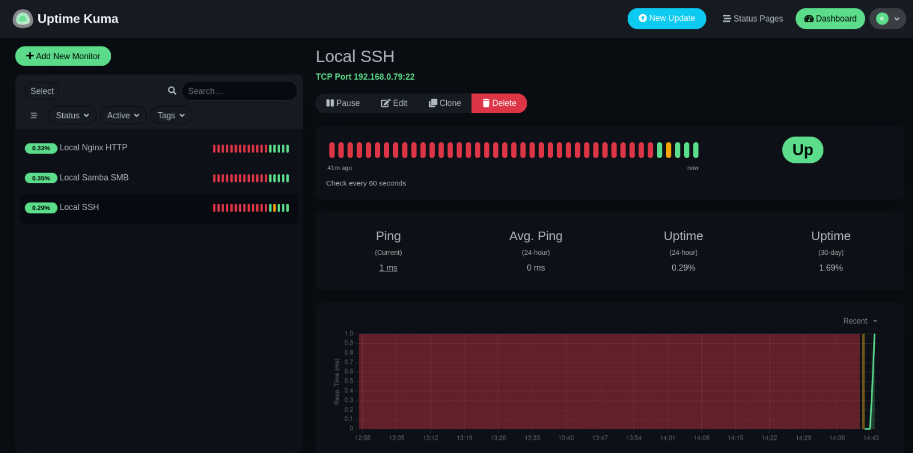
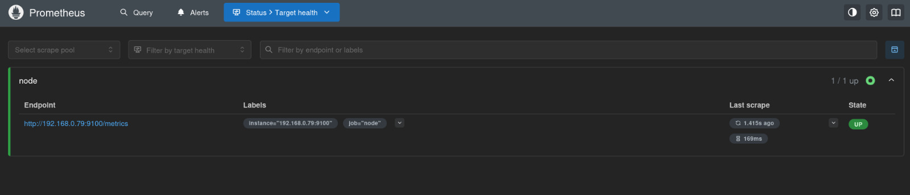
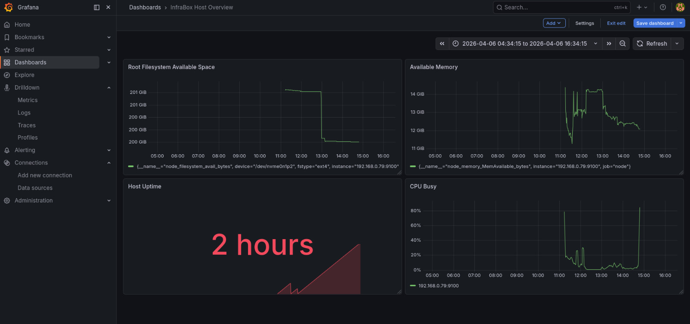

# InfraBox

## Project Overview
InfraBox is a private Linux infrastructure lab built to practice system administration, service monitoring, observability,
containerized tooling, and infrastructure troubleshooting.

The project is designed as a hands-on learning environment focused on real operational reasoning rather than only intalling tools.

## Objectives
 - Build a structured private infrastructure lab on Debian
 - Practice Linux host administration and service validation
 - Monitor service availability with Uptime Kuma
 - COllect host metrics with Node Exporter and Prometheus
 - Visualize host metrics through Grafana
 - Document implementation steps, issues, and resolutions in a professional way

## Current Stack
 - Debian GNU/Linux 13
 - Docker
 - Uptime Kuma
 - Prometheus
 - Node Exporter
 - Grafana
 - UFW
 - Nginx
 - Samba
 - OpenSSH

## Architecture
```
Debian Host (Kiroshi)
|----SSH
|----Nginx
|----Samba
|----Node Exporter
|----UFW
|____Docker
     |---- Uptime Kuma
     |---- Prometheus
     |---- Grafana
```
## Implemented Components

### Host Services
 - OpenSSH for remote administration
 - Nginx for local HTTP service validation
 - Samba for SMB-based file sharing tests
 - Node Exporter for host-level metrics exposure

### Containerized Services
 - Uptime Kuma for availability monitoring
 - Prometheus for metrics scraping and storage
 - Grafana for metrics visualization

## Monitoring and Observability

### Availability Monitoring
Uptime Kuma is used to validate the reachability of key services:
 - SSH
 - Nginx HTTP
 - Samba SMB

### Metrics Collection
Node Exporter runs directly on the Debian host and exposes system metrics through the /metrics endpoint.

### Visualization
Grafana runs in Docker and uses Prometheus as its data source.

A first dashboard called InfraBox Host Overview was created with:
 - Available Memory
 - Root Filesystem Available Space
 - CPU Busy
 - Host Uptime

## Key Troubleshooting Lessons
This project included practical troubleshooting involving:
 - host vs container localhost
 - Docker bridge network source identification
 - UFW source-based firewall rules
 - Prometheus scrape target debugging
 - Grafana persistent volume permission issues
 - YAML formatting and Docker Compose validation

## Repository Structure
```
.
├── README.md
├── compose/
│   ├── grafana/
│   │   └── docker-compose.yml
│   ├── prometheus/
│   │   ├── docker-compose.yml
│   │   └── prometheus.yml
│   └── uptime-kuma/
│       └── docker-compose.yml
├── docs/
│   ├── baseline-report.md
│   ├── day1-notes.md
│   ├── day3-validation.md
│   ├── day4-docker-baseline.md
│   ├── day5-uptime-kuma.md
│   ├── day6-monitoring-baseline.md
│   ├── day7-node-exporter.md
│   ├── day8-grafana.md
│   ├── progress.log
│   └── services.md
└── assets/
    └── screenshots/
```
## Screenshots

### Uptime Kuma


### Prometheus


### Grafana


### Current Status
Phase 1 of the lab is complete:
 - service monitoring baseline established
 - host metrics collection working
 - Prometheus scraping validated
 - Grafana dashboard baseline created

### Next Steps
 - refine Grafana dashboards
 - improve documentation quality and consistency
 - add more screenshots and architecture notes
 - package the project for portfolio presentation
 - optionally extend monitoring to future Raspberry Pi integration
